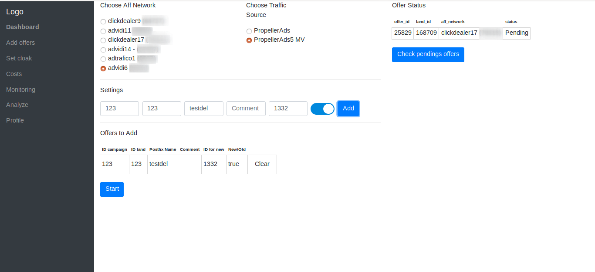
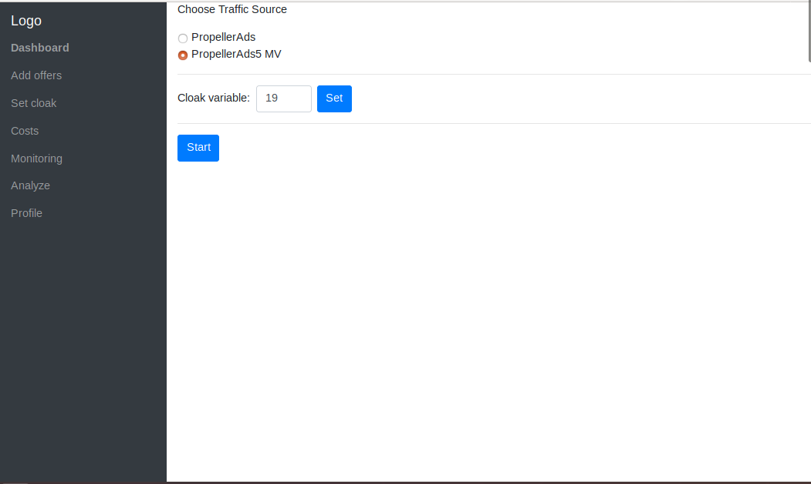
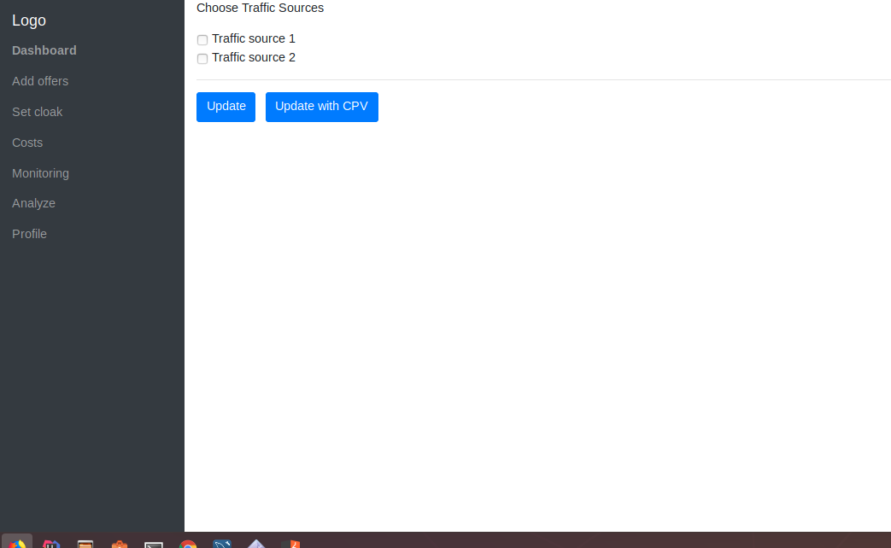
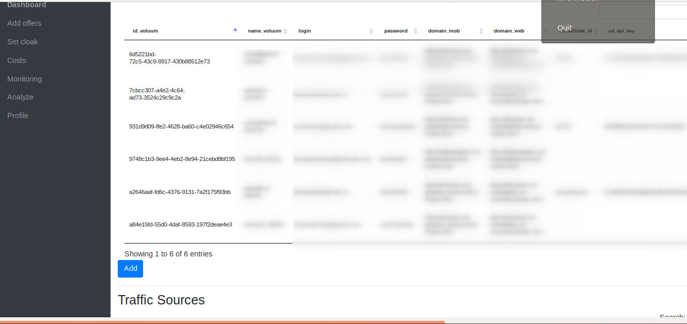
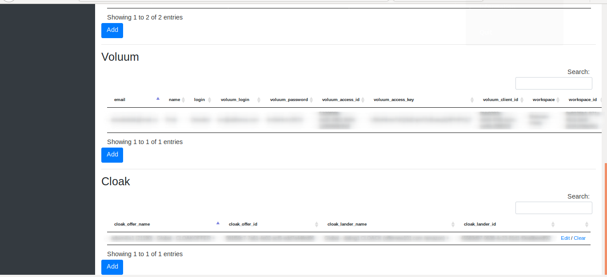

# voluum_combine

Access to automate most of necessary function for working with voluum and affiliates networks

Functions

<ul>
<li>Add offers to new/exist campaign in voluum</li>
<li>Set cloak in new compaign</li>
<li>Renew costs</li>
<li>Add custom setings in your profile</li>
<li>Monitore campaign if it became not profitable and off it</li>
<li>Logging last actions</li>
<li>Analyzing settings of working campaigns</li>
</ul>

Add offers page

Set cloak

Profile page

Profile page

